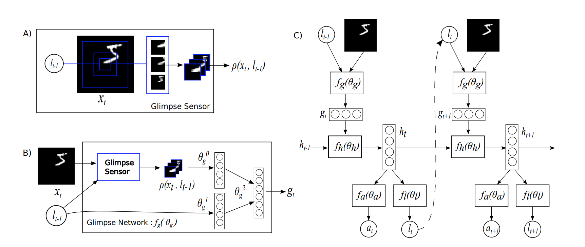

# Recurrent Visual Attention Model (RAM)
 - A TensorFlow implementation of [Recurrent Models of Visual Attention](https://arxiv.org/abs/1406.6247) (NIPS 14)
 - The the model from the paper:
 
 - The core network is an RNN. It takes the representation from glimpse network and previous hidden state as input and then produces the new hidden state.
 - The glimpse network and action network takes the new hidden state as input and produce new glimpse representation and action.
 
## Requirements
- Python 3.3+
- [Tensorflow 1.8+](https://www.tensorflow.org/)

## Implementation Details
- The RAM model is defined in [`lib/model/ram.py`](lib/model/ram.py).
- An example of MNIST dataset classification is in [`example/mnist.py`](example/mnist.py).
- The action network, core network and glimpse network are trained by the classification cross entropy loss.
- The location network is trained by [REINFORCE](http://www-anw.cs.umass.edu/~barto/courses/cs687/williams92simple.pdf).
- The reward baseline network is trained by the MSE loss between baseline and reward.  

## Result
### Centered MNIST

Hyperparameters

*name* | *value* |*name* | *value* |
:---| :---| :--- | :---|
step | 6 |
smallest glimpse | 8 |glimpse scales | 1 |
location std |0.03| pixel to unit width | 12 |
Batch Size | 128 |Max Epoch | 1000 |
Learning Rate <td colspan=3>1e-3 (initial) and decay with 0.97 for every 500 steps |


### Translated MNIST

Hyperparameters

*name* | *value* |*name* | *value* |
:---| :---| :--- | :---|
image size | 60 x 60 | step | 6 |
smallest glimpse | 12 |glimpse scales | 3 |
location std |0.03| pixel to unit width | 26 |
Batch Size | 128 |Max Epoch | 2000 |
Learning Rate <td colspan=3>1e-3 (initial) and decay with 0.97 for every 500 steps |
 


## Usage
### 
- Download the MNIST dataset from [here](http://yann.lecun.com/exdb/mnist/).
- Setup path in [`example/read_mnist.py`](example/read_mnist.py): `DATA_PATH ` is the directory to put MNIST dataset.
- Setup path in [`example/mnist.py`](example/mnist.py): `SAVE_PATH  ` is the directory to save trained models during training. `RESULT_PATH ` is the directory to save prediction results.

### Argument
Run the script [`examples/read_mnist.py`](examples/read_mnist.py) to train and test the model. Here are all the arguments:

* `--train`: Train the model.
* `--eval`: Evaluate the model.
* `--predict`: Get output images with glimpse positions step by step on samples from testing set using the trained model.
* `--batch`: Batch size. Default: `128`.
* `--epoch`: Max number of epochs. Default: `1000`.
* `--lr`: Initial learning rate. Default: `1e-3`.
* `--load`: The epoch ID of trained model to be restored for evaluation or prediction.
* `--dataset`: Dataset used for experiment. Default: `center`. `center` for original MNIST. `translate` for translated MNIST with size 60 x 60.
* `--step`: Number of times the model looking at images before the final prediction. Default: `1`
* `--glimpse`: Size of smallest glimpse. Default: `12`
* `--scale`: Number of glimpse scales. Default: `3`.
* `--std`: Standard deviation for sampling glimpse locations. Default: `0.11`.
* `--pixel`: Unit width in the coordinate system of the model to the number of pixels. Default: `26`.

### Train the model
- Go to `examples/`, then run

```
python --train --dataset DATASET
```
- `--dataset center` for original MNIST. `--dataset translate` for translated MNIST with size 60 x 60.

### Evaluate the model
- Go to `examples/`, then run

```
python --eval --dataset DATASET --load RESTORE_ID
```
- The accuarcy on testing set will be printed out.

## Reference implementation:
- http://torch.ch/blog/2015/09/21/rmva.html
- https://github.com/jlindsey15/RAM
- https://github.com/jtkim-kaist/ram_modified
